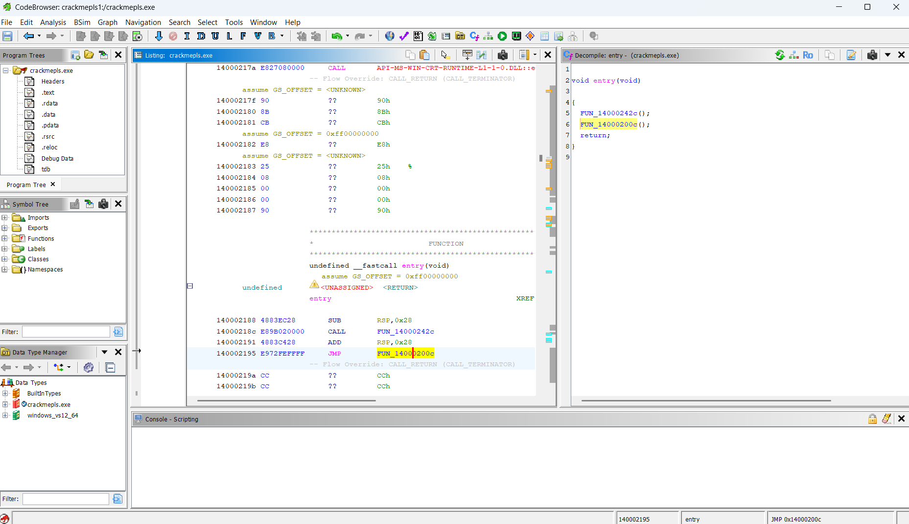
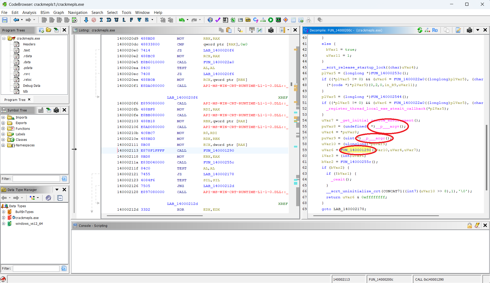
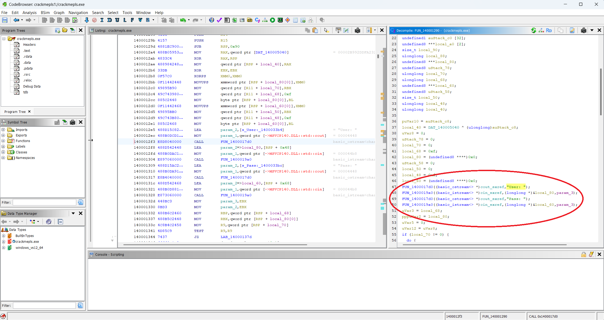
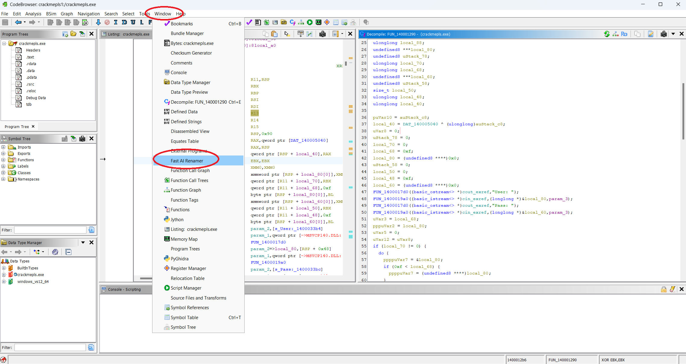
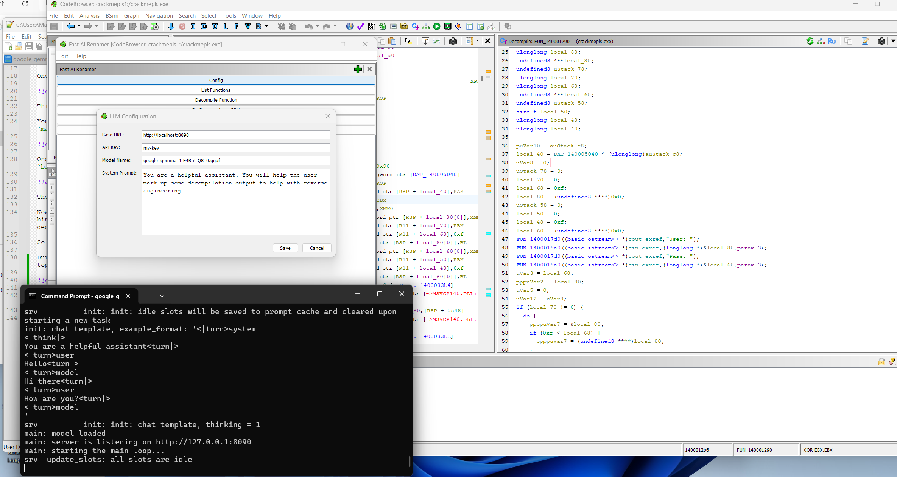
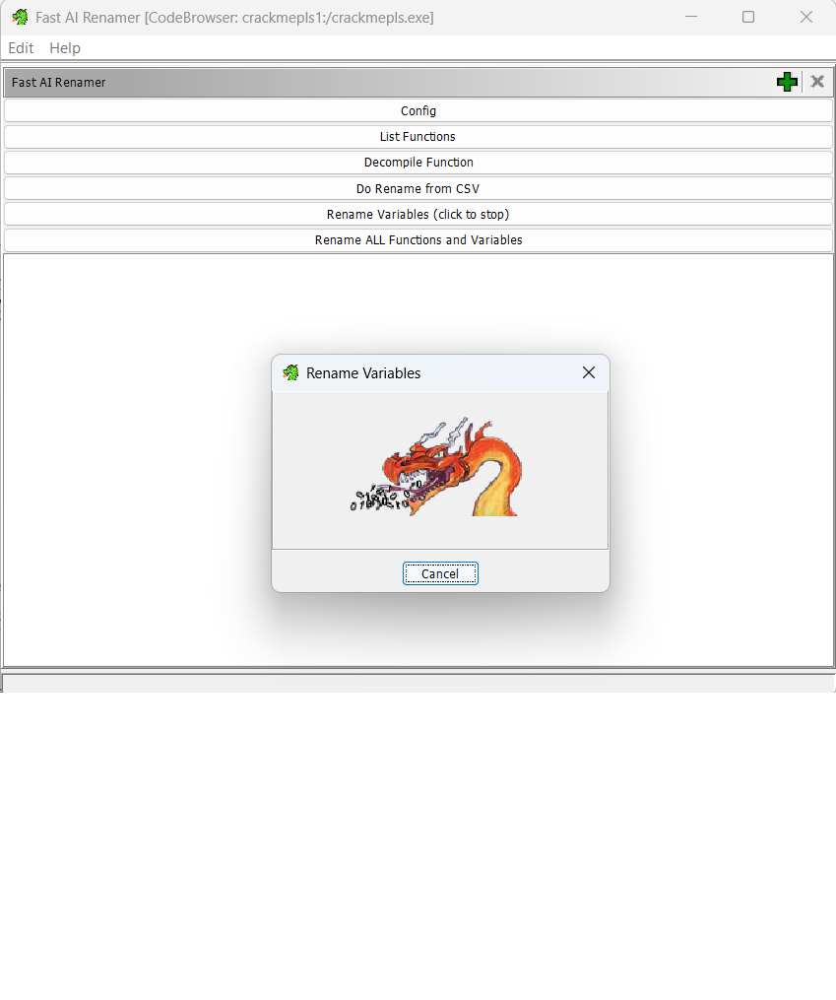
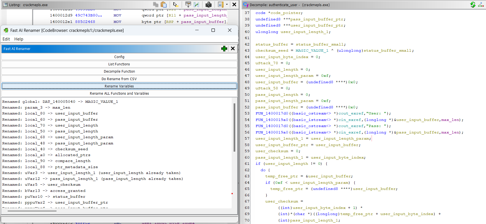
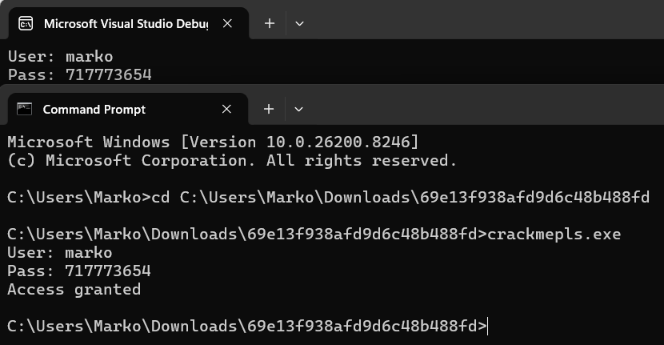
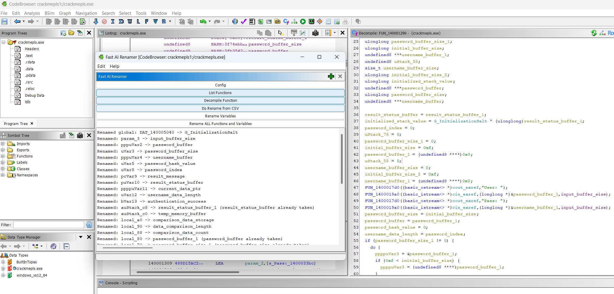

# Using Google's Gemma 4 E4B local AI model to Reverse Engineer a simple Crackme

I was playing around with the new [Gemma E4B open weights local model](https://huggingface.co/google/gemma-4-E4B) which Google released, and to my surprise I was seeing a great deal of success in using it for local offline reverse engineering scenarios. I wanted to write this tutorial to spread the word that local AI is now good enough for many basic reversing tasks, and that things will probably rapidly improve from here on out.

## Reverse Engineering and AI 

One of the most tedious parts of reversing a new binary is at the very beginning, when you have no insights into what the important functions and variables are. There are many tricks which reversers use to get started, including looking at string references, [binary diffing](https://github.com/quarkslab/qbindiff), or [matching similar functions](https://github.com/quarkslab/sighthouse). 

AI is very good at helping out here, and I've personally had great success in using the [OpenAI API](https://openai.com/api/) to mark up a binary or clean up decompiler output. However, there are several disadvantages to using these APIs:

- *Cost* - Decompilation and disassembly generate tons of tokens. The APIs charge $ per token, so larger binaries can take quite a bit of $$$ to analyze. If you're dealing with a large target with many binaries which update each week, these costs can add up quickly, and are prohibitive for hobbyist reverse engineers. 

- *Privacy* - When you're using a remote API, the host of the AI has insight into what you're doing. This is a non-starter in some professional scenarios.

- *Control* - When you rely on a remote API, you have [no control over what models are being served to you](https://www.reddit.com/r/WritingWithAI/comments/1qvul6g/openai_is_quietly_removing_gpt4o_from_chatgpt_for/), or what [the quality of the models is](https://news.ycombinator.com/item?id=47778035). If you rely on them for mission critical stuff, this can be a problem when they [become slow](https://www.reddit.com/r/openrouter/comments/1r4fbxe/openrouter_unreliable_slow_and_more/) or [go down](https://news.ycombinator.com/item?id=47779730) when you need them, or when their output quality degrades to the point that they're useless.

Running your own local AI models addresses some of these pain points:

- *Cost* - It can be much cheaper to run a local model than rely on a hosted service. While your local model is probably smaller and slower than from a good provider, if it's good enough and runs in a reasonable amount of time, it can make sense to save on money by running your own model, especially if you're crunching large amounts of data for simple tasks. 

- *Privacy* - When you run the model locally, there are no network calls happening, and you're in complete control of your privacy. No one can see what you're using the model for on your own machine. 

- *Control* - The beauty of an open weights model is that no one can take it away from you. OpenAI or Anthropic might one day make their SotA models unavailable, either through price increases or by explicitly removing their APIs. But with an open weights model, you're in control of your destiny, for better or worse. 

Local AI models have their *downsides* though:

- *Size* - The larger your model, the more intelligent it is. However, most large models cannot fit onto consumer hardware. Because of that, if you're running a local model, chances are you're running a model that's 10x-100x smaller than a SotA (State-of-the-Art) model. This decrease in size directly leads to a decrease in intelligence in the model, making them [unsuitable for many tasks which people take for granted](https://www.reddit.com/r/ClaudeCode/comments/1stenhn/claude_code_locally_with_ollama_sucks_or_maybe_im/) in SotA models like ChatGPT/Codex or Claude.

- *Speed* - Local models will probably run slower on your machine than when using an AI API. Again, this is due to the limitations of consumer hardware, and some of [the tricks](https://aws.amazon.com/blogs/machine-learning/optimize-your-inference-jobs-using-dynamic-batch-inference-with-torchserve-on-amazon-sagemaker/) which API providers can do which are generally not available to you.

- *Configuration* - Running local models is like trying to run Linux on a refurbished laptop vs walking into the Apple store and buying a clean new Macbook Air. The Codex and Claude Code experience is the Apple store experience of AI. The local AI model experience is the guy with a fedora in his garage banging on a janky computer trying to make it work. At a minimum, you have to worry about the following things:
    - Acquiring the right hardware 
	- GPU Drivers
	- Choose and configure the right inference server 
	- Choose a model which will fit on your hardware, run fast enough that it's practical, and is intelligent enough for the task at hand 
	- Use the right chat template with your model
	- Explore quantizations of the model to find the right tradeoff between size/speed vs model intelligence. 
	- Prompt the model correctly
	- Choose the right harness, or make your own harness if none of the existing ones work. 
	
It's not an easy journey, and many people give up and assume local AI models are not up to the task, because they never found the right combination of hardware/model/settings/prompting/harness to make them work for their task. While in many cases they're right, I hope this tutorial at least shines a light on how far local models have come, how they can with reverse engineering, and inspires people to give local AI a shot. 

## Reverse Enginering Setup

- The crackme is an extremely simple Windows crackme downloaded from [Crackmes.one] here:
https://crackmes.one/crackme/69e13f938afd9d6c48b488fd

(archive password is `crackmes.one`). I've hosted an alternative link here in case the original link goes down (TODO).

- *Ghidra 12.04* is used for disassembly and decompilation. You'll need to install [OpenJDK 21](https://docs.aws.amazon.com/corretto/latest/corretto-21-ug/downloads-list.html) to use it:
https://github.com/nationalsecurityagency/ghidra

- While working on this tutorial I vibe-coded with Claude Code a Ghidra plugin to rename functions and variables with AI. You can download the plugin from here:
*TODO*

To install it, simply move the zip file `ghidra_12.0.4_PUBLIC_20260427_FastAIRenamerPlugin.zip` to `${GHIDRA_HOME}\Extensions\Ghidra`, then run Ghidra by running `${GHIDRA_HOME}\ghidraRun.bat`. To activate the plugin, in the initial Ghidra screen on the top menu select `File -> Install Extensions`, then in the plugin browser check the checkbox next to `FastAIRenamerPlugin`, then click `Ok`. Ghidra will prompt you to restart itself, so do that right away. 

To configure the plugin, next time Ghidra starts, on the top menu go to `Tools -> Run Tool -> CodeBrowser`. Ghidra will say "New Extensions detected. Would you like to configure them?". Click yes, then again check the checkbox next to `FastAIRenamerPlugin`, then click Ok. When the CodeBrowser opens, in the top menu click `Window -> Fast AI Renamer`, then click the `Config` button. Here you will be able to configure your AI model. Close the plugin window and the empty CodeBrowser window once done. 

*Note*: if you have any problems loading the plugin, you might need to enable Developer mode in Ghidra (File -> Configure -> checkbox next to Developer)

*Note*: you can always check if the plugin is loaded by going to the CodeBrowser, clicking File -> Configure -> Ghidra Core -> click the blue configure button -> filter by "FastAIRenamer" -> make sure the checkbox next to its name is checked. 

*Note*: to uninstall the plugin, first open CodeBrowser, File -> Configure -> Ghidra Core -> click the blue configure button -> filter by "FastAIRenamer" -> uncheck -> ok. Close CodeBrowser, then in initial Ghidra window, File -> Install Extensions -> uncheck "FastAIRenamer". Finally close Ghidra and delete `ghidra_12.0.4_PUBLIC_20260427_FastAIRenamerPlugin.zip` from `${GHIDRA_HOME}\Extensions\Ghidra`. To make sure the extension is deleted, next time you run Ghidra, on initial window to go to Help -> Runtime Information -> Extension Points -> filter by "FastAIRenamer" and make sure nothing shows up. phew. 


Finally, make sure you have `Visual Studio` or some other C++ dev environment set up so that you can vibe code a solution to the crackme when the time comes. 

## Local AI Setup 

People's local AI setups will vary wildly depending on the hardware and $$$ they have available. For me:

- I'm personally running an [Nvidia GTX 3080](https://www.techpowerup.com/gpu-specs/geforce-rtx-3080.c3621), with [Cuda 13.2](https://developer.nvidia.com/cuda-toolkit-archive) installed. You can check your Cuda version by running `nvcc --version` in your Windows Terminal.

- I'm running the [https://huggingface.co/bartowski/google_gemma-4-E4B-it-GGUF/blob/main/google_gemma-4-E4B-it-Q8_0.gguf](https://huggingface.co/bartowski/google_gemma-4-E4B-it-GGUF/blob/main/google_gemma-4-E4B-it-Q8_0.gguf) quants from [bartowski](https://huggingface.co/bartowski/google_gemma-4-E4B-it-GGUF). It might be superstition on my part, but for analytical tasks I try to run with the least amount of quantization possible, and avoid it entirely if I can. 

- I'm using `llama.cpp` as my inference server, with this specific version: [llama-b8893-bin-win-cuda-13.1-x64](https://github.com/ggml-org/llama.cpp/releases/tag/b8893).

- I'm running `llama.cpp` with the following CLI settings:
```
..\llama-b8893-bin-win-cuda-13.1-x64\llama-server.exe ^
  --port 8090 ^
  --threads 12 ^
  --n-gpu-layers 256 ^
  --no-mmap ^
  --model "google_gemma-4-E4B-it-Q8_0.gguf" ^
  --ctx-size 32768 ^
  --temp 1.0 ^
  --top-k 64 ^
  --top-p 0.95 ^
  --offline
```

This yields `75 tokens/sec`, which is quite zippy for local AI. 

## No hardware? No problem 

If you don't have the hardware available or are having trouble with configuration, but still want to follow along in this tutorial, you can get an OpenRouter login and use one of the free APIs:
https://openrouter.ai/models/?q=free

Google is specifically offering `Gemma 4 31B` and `Gemma 4 26B-A4B` free right now (for a limited time only):
https://openrouter.ai/google/gemma-4-31b-it:free
https://openrouter.ai/google/gemma-4-26b-a4b-it:free

... just keep in mind with these free APIs, they're slowly, unreliable, and all the data you send to them will probably be logged in their internal analytics and used in their next training run. Still, for the purposes of this tutorial, these APIs should let you follow along. 

To configure the Ghidra plugin to use your OpenRouter login, open *TODO* 

## Inspecting the Crackme

Unzip and run `crackmepls.exe`, you should be greeted with a standard login screen. Type in any random password, and you'll get a 'Access Denied' message:
```
User: marko
Pass: 123
Access denied
```

Open up Ghidra by running `ghidraRun.bat`. In the toolbar select `File -> New Project`, leave `Non-Shared Project` selected and click `Next >>`, then select an empty project directory and give the project a name. Then click `Finish`. 

Next, click `File -> Import File`, then select `crackmepls.exe` to add it to the project. Ghidra will pop up some details about the file, telling you it's a `Portable Executable (PE)` file for `x86:LE:64:default:windows`. Just click `OK` to accept that without changing anything. After a brief delay, it will pop up some more details about the file, again just click `OK` to accept that. Finally, double-click on `crackmepls.exe` in the project to open up the Code Browser, to beging disassembling it. 

At the very beginning, Ghidra will pop up a message saying `crackmepls.exe has not been analyzed. Would you like to analyze it now?`. Click `Yes` and then the `Analyze` button in the next window, and then wait for Ghidra to locate, disassemble, and decompile all the functions in the binary. You might get an error or two during the analysis about PDB files not found, just click `Ok` and ignore them. 

Once Ghidra is done analyzing the file, you should see something like the below:



This is your standard MSVC entrypoint. Double click on `FUN_14000200c` and scroll down. 

You should see references in the decompiler window to `__p___argv`, `__p___argc`, and then a function call `FUN_140001290` which accepts them as parameters. This is probably the `main()` function for the crackme, so double click on it.



Once in function `FUN_140001290`, scroll down a bit in the decompiler window. You will see string references to the strings `User:` and `Pass:`, along with references to `basic_istream` (input stream) and `basic_ostream` (output stream). 



These strings match the print and input statements we saw when we first ran the crackme, so we know we're in the crackme's `main()` function.

Now at this point, the tedious work would begin where we actually have to sit down and rename every variable name and function call to something meaningful, as we analyze what the binary is doing so that we can solve the crackme. Reverse engineers used to have to do this by hand in disassembly, but thankfully technology and tax dollars have given us this nifty decompiler which can be scripted to work with AI. 

So instead of doing real work, let's sit back, turn off our brains, and let our local AI do all the work for us. 

During the setup for this tutorial, you should have installed a Ghidra plugin to help with function and variable renaming. Now is the time to use it. In Ghidra, in the toolbar at the top, click `Window` and then `Fast AI Renamer` to open up the plugin. 



You should see the plugin UI, which is a bunch of buttons and a textarea. Start by clicking the "Config" button, and then make sure you have everything configured to talk to your local AI properly. Here's how it looks on my computer:



You can close the config window by clicking "Save", and then click on the `Rename Variables` button. A progress window with a dragon should pop up, and you might hear your computer start to strain as it works to run the local AI model to rename all the variables in the decompiler window:



Once the AI is done (takes around 10-20 seconds on my machine) you should see a description of which variables it renamed in the plugin's textarea, and the variables themselves should be renamed in the decompiler window:



All AI models, but especially small local ones, are inherently unreliable, so you might see some errors in this last step. We'll touch again on this later. In the meantime, you can always just rerun the AI by clicking the `Rename Variables` button again, until you get results without errors which look satisfactory to you. 

## Solving the Crackme 

At this point, we have some nicely marked up decompiler output, where all the variable names have been renamed to something meaningful. Traditionally, a reverse engineer could now read this code and start to draft a solution for the Crackme. However, I thought it would be neat to try and get the local AI to solve the crackme for us. Remember, we won't be using our brain today. 

First, I had the AI finish marking up the entire binary for us by clicking on the `Rename ALL Functions and Variables` button. This servers to assign names to all the function calls being used in this crackme function, which cleans up the decompiler output even more. On my machine, this takes up about 15 minutes. 

When you're using `llama.cpp` with the CLI params I listed under `Local AI Setup`, you can open up a Chat UI to your local model by navigating in the browser to [http://localhost:8090/](http://localhost:8090/)

Here, I entered the decompiler output of the function from the crackme (you can get it by clicking the "Decompile Function" button in the Plugin UI, or by simply copying it from the decompiler window on the right side), and asked the AI to code up a solution for us:

======================================================================
======================================================================
======================================================================


I want you to help me write a solution for a crackme. Below is the decompiler listing of a function from a crackme, where the user types in a username and a password, and then access is granted if they provided the correct password. The password is computed in the function.

```


/* WARNING: Function: __security_check_cookie replaced with injection: security_check_cookie */
/* **Reasoning:**
   The function takes user input (a username/input and a password) via standard input. It processes
   the user input by calculating a complex, custom checksum/hash. It then compares the provided
   password input against a target buffer (likely a stored hash or secret). Finally, it determines
   and outputs whether "Access granted" or "Access denied," indicating the function serves as an
   authentication routine. */

undefined8 authenticate_user(undefined8 param_1,undefined8 param_2,undefined8 max_len)

{
  uint user_checksum;
  int iVar1;
  undefined8 ****temp_free_ptr;
  ulonglong user_input_byte_index;
  char *result_message;
  undefined1 *status_buffer;
  undefined8 ****data_buffer_ptr;
  ulonglong pass_input_length_1;
  bool access_granted;
  undefined8 uStack_d0;
  undefined1 status_buffer_small [8];
  undefined1 status_buffer_large [32];
  undefined8 ***allocated_ptrs [2];
  size_t compare_length;
  ulonglong ptr_metadata_size;
  undefined8 ***user_input_buffer;
  undefined8 uStack_78;
  ulonglong user_input_length;
  ulonglong user_input_length_param;
  undefined8 ***pass_input_buffer;
  undefined8 uStack_58;
  size_t pass_input_length;
  ulonglong pass_input_length_param;
  ulonglong checksum_seed;
  code *code_pointer;
  undefined8 ***pass_input_buffer_ptr;
  undefined8 ***user_input_buffer_ptr;
  ulonglong user_input_length_1;
  
  status_buffer = status_buffer_small;
  checksum_seed = MAGIC_VALUE_1 ^ (ulonglong)status_buffer_small;
  user_input_byte_index = 0;
  uStack_78 = 0;
  user_input_length = 0;
  user_input_length_param = 0xf;
  user_input_buffer = (undefined8 ****)0x0;
  uStack_58 = 0;
  pass_input_length = 0;
  pass_input_length_param = 0xf;
  pass_input_buffer = (undefined8 ****)0x0;
  formatted_string_output((basic_ostream<char,struct_std::char_traits<char>_> *)cout_exref,"User: ");
  extract_token_from_stream((basic_istream<char,struct_std::char_traits<char>_> *)cin_exref,
                (longlong *)&user_input_buffer,max_len);
  formatted_string_output((basic_ostream<char,struct_std::char_traits<char>_> *)cout_exref,"Pass: ");
  extract_token_from_stream((basic_istream<char,struct_std::char_traits<char>_> *)cin_exref,
                (longlong *)&pass_input_buffer,max_len);
  user_input_length_1 = user_input_length_param;
  user_input_buffer_ptr = user_input_buffer;
  user_checksum = 0;
  pass_input_length_1 = user_input_byte_index;
  if (user_input_length != 0) {
    do {
      temp_free_ptr = &user_input_buffer;
      if (0xf < user_input_length_param) {
        temp_free_ptr = (undefined8 ****)user_input_buffer;
      }
      user_checksum =
           ((int)user_input_byte_index + 1) *
           (int)*(char *)((longlong)temp_free_ptr + user_input_byte_index) +
           (int)pass_input_length_1;
      user_checksum = user_checksum * 8 ^ user_checksum;
      user_input_byte_index = user_input_byte_index + 1;
      pass_input_length_1 = (ulonglong)user_checksum;
    } while (user_input_byte_index < user_input_length);
  }
  int_to_string_dynamic(allocated_ptrs,user_checksum * 0x539 ^ 0x5a5a);
  pass_input_length_1 = pass_input_length_param;
  pass_input_buffer_ptr = pass_input_buffer;
  temp_free_ptr = &pass_input_buffer;
  if (0xf < pass_input_length_param) {
    temp_free_ptr = (undefined8 ****)pass_input_buffer;
  }
  data_buffer_ptr = allocated_ptrs;
  if (0xf < ptr_metadata_size) {
    data_buffer_ptr = (undefined8 ****)allocated_ptrs[0];
  }
  if (compare_length == pass_input_length) {
    if (compare_length == 0) {
      access_granted = true;
    }
    else {
      iVar1 = memcmp(data_buffer_ptr,temp_free_ptr,compare_length);
      access_granted = iVar1 == 0;
    }
  }
  else {
    access_granted = false;
  }
  if (0xf < ptr_metadata_size) {
    temp_free_ptr = (undefined8 ****)allocated_ptrs[0];
    status_buffer = status_buffer_small;
    if (0xfff < ptr_metadata_size + 1) {
      temp_free_ptr = (undefined8 ****)allocated_ptrs[0][-1];
      data_buffer_ptr =
           (undefined8 ****)((longlong)allocated_ptrs[0] + (-8 - (longlong)temp_free_ptr));
      status_buffer = status_buffer_small;
      if ((undefined8 ****)0x1f < data_buffer_ptr) {
        code_pointer = (code *)swi(0x29);
        (*code_pointer)(5);
        temp_free_ptr = data_buffer_ptr;
        status_buffer = status_buffer_large;
      }
    }
    *(undefined8 *)(status_buffer + -8) = 0x140001424;
    free(temp_free_ptr);
  }
  result_message = "Access granted\n";
  if (!access_granted) {
    result_message = "Access denied\n";
  }
  *(undefined8 *)(status_buffer + -8) = 0x140001443;
  formatted_string_output((basic_ostream<char,struct_std::char_traits<char>_> *)cout_exref,result_message);
  if (0xf < pass_input_length_1) {
    temp_free_ptr = (undefined8 ****)pass_input_buffer_ptr;
    if (0xfff < pass_input_length_1 + 1) {
      temp_free_ptr = (undefined8 ****)pass_input_buffer_ptr[-1];
      data_buffer_ptr =
           (undefined8 ****)((longlong)pass_input_buffer_ptr + (-8 - (longlong)temp_free_ptr));
      if ((undefined8 ****)0x1f < data_buffer_ptr) {
        code_pointer = (code *)swi(0x29);
        (*code_pointer)(5);
        status_buffer = status_buffer + 8;
        temp_free_ptr = data_buffer_ptr;
      }
    }
    *(undefined8 *)(status_buffer + -8) = 0x14000147d;
    free(temp_free_ptr);
  }
  if (0xf < user_input_length_1) {
    temp_free_ptr = (undefined8 ****)user_input_buffer_ptr;
    if (0xfff < user_input_length_1 + 1) {
      temp_free_ptr = (undefined8 ****)user_input_buffer_ptr[-1];
      data_buffer_ptr =
           (undefined8 ****)((longlong)user_input_buffer_ptr + (-8 - (longlong)temp_free_ptr));
      if ((undefined8 ****)0x1f < data_buffer_ptr) {
        code_pointer = (code *)swi(0x29);
        (*code_pointer)(5);
        status_buffer = status_buffer + 8;
        temp_free_ptr = data_buffer_ptr;
      }
    }
    *(undefined8 *)(status_buffer + -8) = 0x1400014b7;
    free(temp_free_ptr);
  }
  *(undefined8 *)(status_buffer + -8) = 0x1400014c9;
  return 0;
}


```

Please read the decompiler listing, and then complete my C++ code below to compute the correct password for an inputted username:

```
#include <cstdio>
#include <cstdint>
#include <string>
#include <iostream>

int main()
{
    std::string username;
    std::cout << "User: ";
    std::cin >> username;


    uint32_t password_value = 0;

    std::cout << "Pass: " << password_value << "\n";
    return 0;
}

```

======================================================================
======================================================================
======================================================================

## The Generated Solution


The first time it generated a solution, it was incorrect. I've included it in [tut1.txt](tut1.txt) in this repo. At first glance the solution _looks_ correct, but fails when we try it. AIs are fundamentally unreliable, and this is a perfect example of that. 

No matter, we can simply open a new chat, copy-paste the prompt above, and try to get the AI to generate a new solution for us. In my case, I got a working solution on the second try:

```
#include <cstdio>
#include <cstdint>
#include <string>
#include <iostream>
#include <sstream>
#include <iomanip>

/**
 * @brief Simulates the custom checksum calculation defined in the crackme function.
 *
 * @param username The input string (username).
 * @return int The final calculated user_checksum.
 */
int calculate_username_checksum(const std::string& username) {
    // user_checksum is treated as an 'int' (32-bit signed integer) during the core calculation.
    int user_checksum = 0;

    // pass_input_length_1 acts as the state variable and is a ulonglong (64-bit).
    // It starts at 0, as pass_input_length_1 = user_input_byte_index (which is 0) initially.
    uint64_t state_pass_length_1 = 0;

    for (size_t i = 0; i < username.length(); ++i) {
        // i = user_input_byte_index

        // Step 1: Calculate the intermediate value T1.
        // The decompiler implies this calculation happens using standard int math 
        // (truncating/wrapping if intermediate values exceed 32 bits).
        // (int)user_input_byte_index + 1
        int index_term = (int)(i + 1);

        // (int)*(char *)((longlong)temp_free_ptr + user_input_byte_index)
        // This is just the ASCII value of the character.
        int char_term = (int)username[i];

        // (int)pass_input_length_1
        // The state is cast down to an int for this arithmetic operation.
        int state_term = (int)state_pass_length_1;

        // T1 = ((int)user_input_byte_index + 1) * (int)char + (int)state
        int intermediate_t1 = index_term * char_term + state_term;

        // Step 2: Apply the XOR/Multiplication hash function.
        // user_checksum = user_checksum * 8 ^ user_checksum;
        // Note: The original code structure suggests the update happens here, 
        // but since we are recalculating the hash step-by-step, we use the definition:
        // user_checksum = T1 * 8 ^ T1; 

        // Since the original code overwrites user_checksum completely with the hash 
        // of the current character, we use the T1 derived above.

        int current_checksum = intermediate_t1;
        current_checksum = current_checksum * 8 ^ current_checksum;

        // Update the final running checksum
        user_checksum = current_checksum;

        // Step 3: Update the state variable for the next iteration.
        state_pass_length_1 = (uint64_t)user_checksum;
    }

    return user_checksum;
}


int main()
{
    std::string username;
    std::cout << "User: ";
    std::cin >> username;

    // 1. Calculate the final checksum using the username
    int final_user_checksum = calculate_username_checksum(username);

    // 2. Calculate the final hash/secret value
    // FinalHashValue = user_checksum * 0x539 ^ 0x5a5a
    // Note: The arithmetic here is done on the final 32-bit 'int' checksum.
    uint32_t final_hash_value = (uint32_t)final_user_checksum * 0x539 ^ 0x5a5a;

    // 3. Convert the final hash value into a string (as implied by int_to_string_dynamic)
    // Since the password needs to match the memory contents (memcmp), it must be the string representation.
    std::stringstream ss;
    ss << final_hash_value;
    std::string required_password = ss.str();


    // We output the required password string.
    std::cout << "Pass: " << required_password << "\n";
    return 0;
}
```

I included the chat which generated the solution as [solution_chat.html](solution_chat.html) in this repo. It included the reasoning stream, which I thought was pretty cool for such a tiny model running locally. 

Anyways, we can compile the solution with Visual Studio and then run it to generate a valid username/password combo. We then input the username/password into the crackme, and verify that we've solved it:



gg


## Limitiations, Hallucinantions, and Errors 

As we've seen multiple times throughout this tutorial, AI is inherently unreliable. Consider the two screenshots below:
 




The first screenshot is from before in the tutorial, while the second screenshot was taken at the same step, just with a different rerun of the AI renaming. Notice in the decompiler window, how in the top screenshot the password input buffer is labelled `&pass_input_buffer`, while in the bottom screenshot the same buffer is labelled `&username_buffer_1`. In the bottom screenshot, the AI is lying to us, and we call those lies "hallucinations".

All AI will lie to you and hallucinate. The smaller the model, the more frequent the hallucinations. The larger the model, the luckier you will get and the less they will hallucinate. The more you pay, the luckier you get. However, no AI model is immune to hallucinatons, and you must never forget this as you work with them. 

AI is best suited for tasks where you can verify the ouput, or the output is low-stakes enough that perfect accuracy is not necessary. In the case of reverse engineering, AI can help us quickly take a peek at an unknown binary and save us a lot of tedious manual work. But as we've seen with the bad renaming it did, it can also lead us down the wrong path. Always treat AI-generated results with caution, and always verify them if you can. 

The best way to use AI is to verify its results automatically. For example, if you're having AI write code, it would be great to have a script which tests the AI's output against some test suite you wrote by hand. In the case of AI generating a solution for our crackme, we could've written a test suite which tests each AI generated solution against the crackme automatically, and then accepted a solution which generated good passwords for thousands of different usernames. Then we could run the AI in a loop, until it wrote a solution which passed our tests. 

## Limitations of small models 

We solved this crackme with a relatively small model (Gemma 4 E4B). This model has 8 billion parameters, unlike the SotA models which exist [which have hundreds of billions if not trillions of parameters](https://huggingface.co/deepseek-ai/DeepSeek-V4-Pro). A smaller model won't be able to reason well, will hallucinate more frequently, and will become useless faster as its context window fills up. 

In a real reverse engineering exercise, we might have to reverse engineer functions which are larger than the context window of our small model, or which have logic which is too convoluted for its limited intelligence to reason about. We need to be familiar with the limitations of our models when we use them, so that we understand ahead of time where they will fail us and how. 

As consumer hardware advances hand-in-hand with model architecture, I believe we'll be able to run larger and better models locally, which will put even more advanced reverse engineering tasks within reach for our local models. 

## Future Work 

The "Fast AI Renamer" Ghidra plugin I wrote currently writes a summary for each function it analyzes, and it has the ability to mass export the C & asm listings of the project it's working on. I'd like to write a tool which computes an [embedding](https://huggingface.co/google/embeddinggemma-300m) for each function summary and then indexes it in a [Vector database](https://github.com/datastax/jvector) or [SQLite](https://github.com/sqliteai/sqlite-vector), and then we can query the database to find functions according to natural language queries.

The Ghidra plugin currently uses a simple workflow without multi-turn conversation for renaming, and relies on parsing a CSV from the AI output to do its task. I implemented things this way because I didn't think a small AI model would be able to handle the long conversations and multiple tool calls inherent to an agentic workflow. I might be wrong, and alternative ways of prompting the AI should be explored. Still, for small local models, I think it's best to limit the context window size as much as possible. 

I'm not sure how vulnerable the Ghidra plugin is to prompt injection, and any security professionals should be wary of using it to analyze malware or hostile binaries. In general, this applies to all AI-powered reverse engineering tools, which might have localhost unauthenticated MCP servers, or tools available for sensitive functions which can achieve code execution. Be careful. 

Given that we're using a small general-purpose model for reverse engineering, I wonder how much its performance can be improved by fine tuning it on conversations [distilled](<https://medium.com/@jsmith0475/a-detailed-technical-comparison-of-fine-tuning-and-distillation-in-large-language-models-cccbe629dcba>) from a larger and more intelligent model? 

Finally, the Ghidra plugin's C/asm export functionality work well with Claude Code, and I was able to use Claude Code + Sonnet to write a correct solution for this crackme on the first time, by just feeding it the marked up decompilation of the crackme and telling it to find a solution. I wonder if there's any skills we can write for Claude Code which might make it better at analyzing a binary through the text files of its decompiler output, and not making it go through an MCP server to Ghidra to perform the analysis. For example, we could introduce a <dump bytes> skill to Claude Code which would let it inspect the bytes in the Virtual Memory of the binary, so that if it sees some data being references from the disassembly/decompiler listings, it can see what that memory contains without having to go through Ghidra.

## Thanks and Acknowledgements 

Thanks to [Kryptos](https://crackmes.one/user/Kryptos) for making the Crackme, and [Crackmes.one](https://crackmes.one) for hosting it. I appreciate them for picking up where crackmes.de left off (RIP).

Thanks to Google for releasing an amazing and nifty local model.

Thanks to the NSA for using my tax dollars to make a cool reverse engineering tool, and thanks to [Ryan Kurtz](https://github.com/ryanmkurtz) for all the support he provides on the Ghidra Github. 